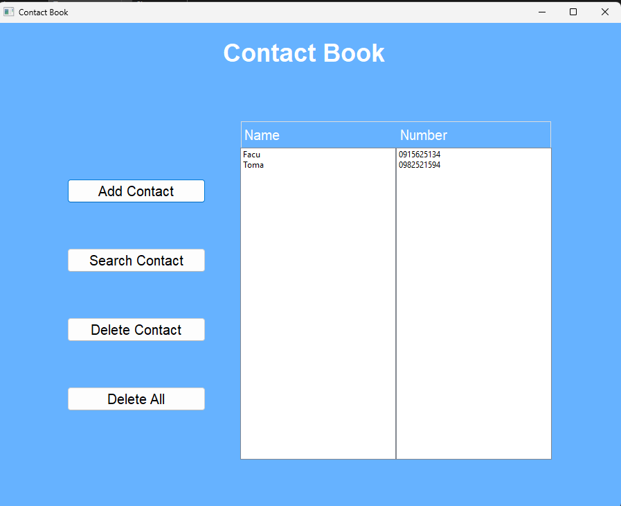

# Contact Book Application

Welcome to the Contact Book application! This project helps users manage their contacts efficiently.

## Features

- **Add Contacts**: Store contact details such as name, phone number, and email.
- **Edit Contacts**: Modify existing contact details.
- **Delete Contacts**: Remove contacts that are no longer needed.
- **Search Contacts**: Quickly find a contact by name or phone number.
- **Sort Contacts**: Organize contacts alphabetically or by other criteria.

## Getting Started

To get a local copy of this project up and running, follow these steps:

### Prerequisites

- **C++ Compiler**: Ensure you have a C++ compiler installed on your system.

### Installation

1. **Clone the Repository**:
   ```bash
   git clone https://github.com/alexsto03ckel/Contact-Book.git
   ```
2. **Navigate to the Project Directory**:
   ```bash
   cd Contact-Book
   ```
3. **Compile the Application**:
   ```bash
   g++ -o ContactBook main.cpp Contact.cpp UI.cpp
   ```
4. **Run the Application**:
   ```bash
   ./ContactBook
   ```

## Usage

Upon running the application, you will see a graphical interface with the following features:

- **Contact List**: Displays saved contacts with their details.
- **Add Contact Button**: Allows users to add a new contact.
- **Search Contact Button**: Quickly find a contact.
- **Delete Contact Button**: Remove a selected contact.
- **Delete All Button**: Clears all contacts.

### Screenshot

Here is how the application looks:



## Contributing

Contributions are welcome! If you'd like to contribute:

1. Fork the repository.
2. Create a new branch:
   ```bash
   git checkout -b feature/YourFeature
   ```
3. Commit your changes:
   ```bash
   git commit -m "Add YourFeature"
   ```
4. Push to the branch:
   ```bash
   git push origin feature/YourFeature
   ```
5. Open a Pull Request.

## License

This project is licensed under the MIT License. See the `LICENSE` file for details.

## Contact

For any questions or suggestions, please open an issue in this repository.

